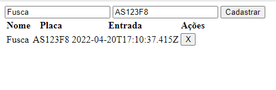
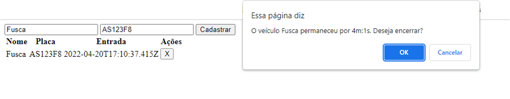
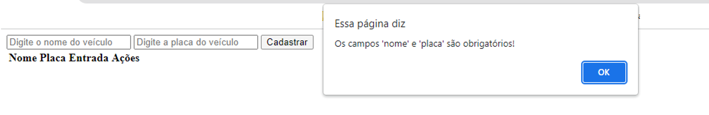

# Sistema para Estacionamento

### Definição do projeto
Um sistema para controle de acesso de um estacionamento, contendo campos para entrada de dados sobre os veículos estacionados e uma tabela para os dados já registrados.

### Como funciona
Cada veículo ao entrar no estacionameno será registrado (nome e placa), esse registro fará parte de uma tabela com todos os registros ativos no momento. Para a saída do veículo será 'fechado' o registro, que será excluído da tabela de usuários ativos, e será calculado e exibido na tela o tempo de permanencia do veículo no estacionamento. Essa finalização será feita depois que o usuário confirmar que deseja encerrar o registro.

### Por que usar *TypeScript*
***TypeScript*** não é uma linguagem de programação, é um *superset* ou superconjunto de ***JavaScript*** que permite escrever código de forma mais eficiente, pois permite tipar o JS facilitando refatoração e correção de bugs. Inicialmente parece que estamos escrevendo mais código, mas isso na verdade é uma vantagem já que tipando o JavaScript saberemos quais serão os retornos evitando o retrabalho, escrevendo o código corretamente já na primeira vez.

O *TypeScript* oferece benefícios como:
- Classes
- Módulos 
- Tipos 
- Navegação no código fonte 
- Interfaces

### Pré requisitos
Este projeto é relativamente simples, porém, ter alguns conhecimentos prévios pode proporcionar uma melhor experiência.
- Conhecimento em ***HTML***, a documentação pode ser consultada [aqui](https://developer.mozilla.org/pt-BR/docs/Web/HTML)
- Conhecimento em ***JavaScript*** preferencialmente [ES6](https://www.w3schools.com/js/js_es6.asp)

### Setup
É necessário ter instalados:
- ***Node*** com o gerenciador de pacotes ***npm***, diponível [aqui](https://nodejs.org/en/)
  - a versão do *node* usada neste projeto foi `v16.14.0`
- editor de código ***VS Code*** disponível neste [link](https://code.visualstudio.com/)
- ***TypeScript*** 
  - caso ainda não tenha instalado basta usar no terminal o comando `npm install -g typescript`

### Como foi feito
#### Etapa 1
A primeira ação é criar um projeto *TypeScript*:
- navegar até a pasta onde será construído o projeto
- dentro da pasta, no terminal, usar o comando:

  `npx -p typescript tsc --init`

  Isso deve gerar um arquivo `tsconfig.json` que  especifica os arquivos raiz e as configurações de compilação necessárias para o projeto.

#### Etapa 2
Deve ser criada a estrutura *HTML* que será exibida no navegador
- criar um documento `index.html` 
- dentro do *index*, para criar uma estrutura básica em html pode-se usar o atalho:
  - digita-se `!` e em seguida a tecla `tab`

    Ou pode ser criado o arquivo manualmente
- criar os campos do formulário
  - 2 **inputs** que devem ter:
    -  *type*
    -  *id*
    -  *placeholder*
    -  *autocomplete* desligado
  - 1 botão que deve ter:
    - *id* 
  - 1 tabela que deve ter:
    - *thead* com 4 colunas
    - *tbody* com *id* 
- colocar uma tag *`<script>`* que conterá o documento JavaScript que será gerado após a transpilação do documento TypeScript

#### Etapa 3
Deve ser criado o arquivo *`script.ts`*, nele serão criadas as funções associadas às ações que poderão ser realizadas pelo programa
- criar a *`Interface`* é um ponto importante, pois é ela que determina os itens que o objeto deve conter e seus respectivos tipos.
- para esse projeto será criada uma `function` anônima que conterá todas as outras funções do programa.
- as funções disponíveis são:
  - `calculaTempo()` para realizar o cálculo do tempo de uso de cada veículo quando estes forem excluídos da tabela 
  - `patio()` que contem todas as ações do programa e dentro desta:
    - `ler()` que recebe um `Array` de objetos (veículos) registrados
    - `salvar()` que salva um novo registro de entrada
    - `adicionar()` que lança na tabela o novo registro salvo
    - `remover()` que apaga o registro da tabela encerrando o tempo de uso do estacionamento, é aqui que será chamada a função `calculaTempo()` 
    - `render()` para renderizar todos os registros ativos

Neste arquivo haverá ainda uma função que será ativada pelo ***evento de click*** no botão e um ***alert*** para avisar ao usuário que os campos são de preenchimento obrigatório, caso ele tente salvar um registro vazio.

Todo arquivo ***TypeScript*** precisa ser transpilado para gerar um arquivo ***JavaScript***, pois só esse será aceito pelo navegador. A transpilação nesse caso foi feita de forma manual, pode ser realizada a cada implementação de função com o comando:

`npx -p typescript tsc`

A data que é apresentada pelo objeto `Date`, nativo do *JavaScript*, possui um formato específico que contem dia da semana, dia do mês, hora, minuto, segundo, e fuso horário e para evitar o excesso de informações na tabela, a data foi editada para o formato ISO do tipo *string*

... `new Date().toISOString()`...

#### Aparência
Aplicação com 1 registro

Registro sendo encerrado

Tentativa de salvar registro com campos vazios

#### Outras informações
- objeto `Date` mais informações [aqui](https://developer.mozilla.org/pt-BR/docs/Web/JavaScript/Reference/Global_Objects/Date)
- `TypeScript` mais informações:
  - [Introdução ao TypeScript](https://docs.microsoft.com/pt-br/learn/modules/typescript-get-started/) 
  - [Criar aplicativos JavaScript usando o TypeScript](https://docs.microsoft.com/pt-br/learn/paths/build-javascript-applications-typescript/)
  - No site [typescriptlang](https://www.typescriptlang.org/)
- `JavaScript` mais informações 
  - Nesta documentação do [Mozilla](https://developer.mozilla.org/pt-BR/docs/Web/JavaScript)
  - No site [javascript.com](https://www.javascript.com/)
- `Node` mais informações sobre o node 
  - No site [oficial](https://nodejs.org/en/about/)  
  - Neste artigo do [DevMedia](https://www.devmedia.com.br/node-js/)
- `npx` & `npm` 
  - Sobre [npx](https://nodejs.dev/learn/the-npx-nodejs-package-runner) 
  - Sobre [npm](https://nodejs.dev/learn/an-introduction-to-the-npm-package-manager)
  - Sobre [*npx vs npm*](https://medium.com/codex/are-npm-and-npx-the-same-567104f13bf0)
  - E mais [aqui](https://docs.npmjs.com/)

#### Proximos passos
- Estilização da aplicação com *CSS* - inputs, botão e tabela
- Validações do conteúdo dos campos (*regex* talvez) 
- Estilizar o *alert* e o *confirm*
- Formatar a data para uma exibição mais simples